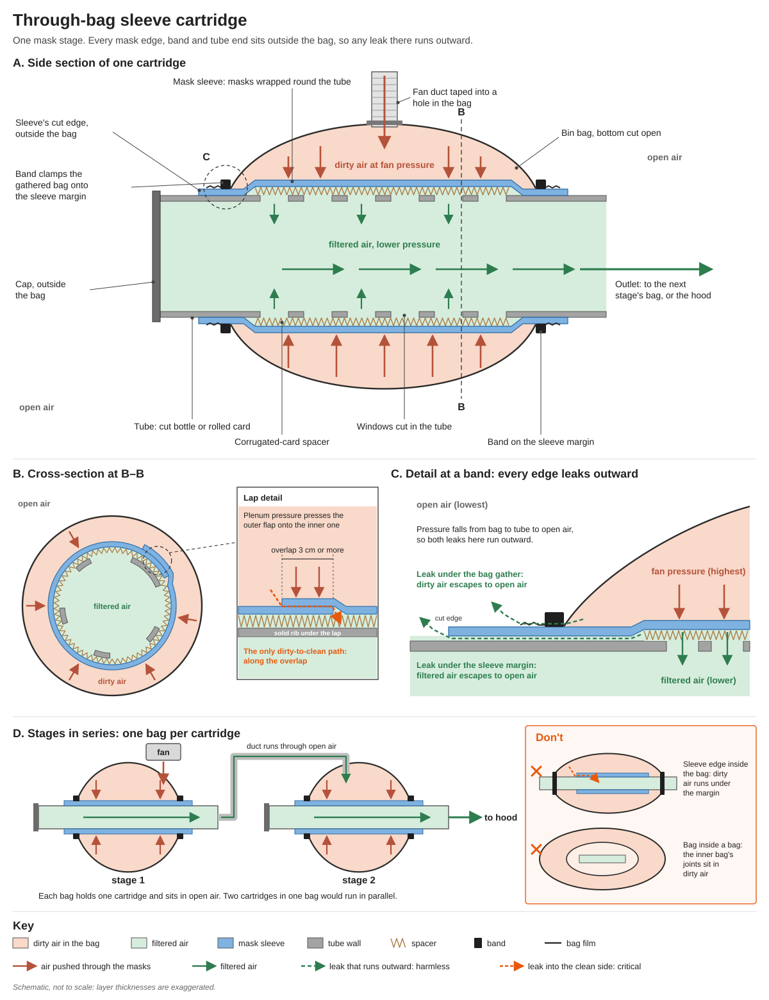

# Mask-based filter bank: leakage and design

Working analysis, 14 September 2026. Nothing here has been built. Numbers are count-based
PF at 0.3 µm from the IIR mask fit in `testing/coefficients.json` (flat sweep, 5.1–54 cm/s).
That sweep's external 0.5/0.3 µm ratio was 0.28, close to the incense runs (0.32–0.36) and
far from background aerosol (0.58–0.62), so it is not the optimistic case. 180 L/min and
131 cm² usable per mask (30% loss) unless stated. Constructed multi-material builds have run
at about half their predicted PF, so treat the tables as upper estimates until a cartridge
is measured.

## Summary

- **A 2×2 gives 3.2 logs but costs ~180 Pa**, essentially the whole fan budget. The sheet's
  115 Pa estimate implies ~5 Pa/(cm/s) per layer, the electret layer's figure; the
  whole-mask sweep measured 7.8. Eight masks as two stages of four give 4.4 logs at 90 Pa.
- **"Leak ≪0.1%" is the single-stage requirement.** In independent stages in series, what
  matters is each stage's bypass relative to that stage's own penetration (0.6–2.4% here).
  Three stages, or two mask stages plus a blanket stage, still clear 3 logs at 3% bypass
  per stage.
- **Leak through an empty gap goes as the gap cubed.** At 45 Pa across a 3 cm lap, a gap
  along 30 cm leaks 0.07% at 100 µm, 0.6% at 200 µm and 9% at 500 µm. The taped mask build's
  measured 7–10% corresponds to a ~0.3 mm effective gap. This is why pressed plates fail:
  one 0.5 mm dip dominates the whole seal.
- **A fibre-filled gap leaks linearly, not cubically.** The same 500 µm gap packed with fleece
  leaks 0.04%.
- **Recommended: the through-bag sleeve cartridge (§5).** Masks wrapped as a sleeve on a
  slotted tube, with the plenum bag banded onto the sleeve margins so every mask edge, clamp
  and tube end sits outside the bag. Under positive pressure those can only leak clean air
  outward. The only dirty-to-clean paths left are the laps and the media itself.
- **Chain two or three cartridges, each in its own bag.** Never nest one bag in another.

## 1. What masks buy

Stages in each row carry equal area: masks per stage × 131 cm².

| Build (stages × masks each) | Face velocity (cm/s) | Δp (Pa) | Logs, 0.3 µm | Logs, 0.5 µm |
|---|---:|---:|---:|---:|
| 1 × 10 | 2.3\* | 18 | 3.56 | 4.21 |
| 2 × 2 | 11.5 | 179 | 3.24 | 3.47 |
| 2 × 3 | 7.6 | 120 | 3.87 | 4.18 |
| 2 × 4 | 5.7 | 90 | 4.42 | 4.87 |
| 3 × 3 | 7.6 | 179 | 5.80 | 6.27 |
| 3 × 4 | 5.7 | 134 | 6.64 | 7.30 |

\* Below the 5.1 cm/s measured floor, with α on the 2/3 cap.

Masks resist 9× more per cm than grey fuzzy (186 vs 20 Pa/(cm/s)/cm), so their area is
fixed by how many you have and they cannot be stuffed or packed. That is what forces a mask
design into the sealing problem that a stuffed blanket roll avoids. The payoff is size: the
2 × 4 build is two tubes about 10 cm across and 25 cm long, where the blanket roll is about
30 × 45 cm.

## 2. The leak requirement, restated

Parallel paths average penetration; series stages multiply it, in any order:

    P_stage = f + (1 − f)·p        P_total = Π P_stage

where f is the bypass fraction of that stage and p its media penetration. Total logs at a
per-stage bypass f:

| Build | Δp (Pa) | f = 0 | 0.3% | 1% | 3% | 10% |
|---|---:|---:|---:|---:|---:|---:|
| 1 × 10 | 18 | 3.56 | 2.48 | 1.99 | 1.52 | 1.00 |
| 2 × 2 | 179 | 3.24 | 3.14 | 2.94 | 2.55 | 1.83 |
| 2 × 4 | 90 | 4.42 | 4.08 | 3.59 | 2.89 | 1.95 |
| 3 × 3 | 179 | 5.80 | 5.50 | 5.00 | 4.15 | 2.87 |
| 3 × 4 | 134 | 6.64 | 6.12 | 5.38 | 4.33 | 2.93 |
| Blanket stage + 2 × 4 | 180 | 5.59 | 5.24 | 4.75 | 4.05 | 3.12 |

The blanket stage is one grey fuzzy blanket at 90 Pa in the uniform limit: 7.6 layers over
1,470 cm², 2.0 cm/s, 1.18 logs, with its own bypass held at 0.2%. It is the only row that
clears 3 logs if the taped build's 10% bypass carried over to each mask stage.

Multiplication only holds if stage leaks are independent: separate cores, separate bags with
ambient air between them, and no clamp surface or core shared between stages. At a fixed
gap, f scales with the stage's Δp, because total flow is fixed.

## 3. Leak physics

Gaps up to 0.5 mm stay laminar at these pressures (Re ≈ 0.3–70), so slot flow applies:

    Q_leak = b·h³·Δp / (12·μ·L)

with b the seal length, h the gap and L the path length across the seal. At 45 Pa across
the stage (the 2 × 4 build), b = 30 cm (two 15 cm laps) and L = 3 cm:

| Gap h | Empty gap | Fleece-filled gap |
|---|---:|---:|
| 100 µm | 0.07% | 0.008% |
| 200 µm | 0.6% | 0.014% |
| 500 µm | 9% | 0.04% |
| 2 mm | — | 0.15% |

The allowable empty gap for 0.1% is about 110 µm, uniform along the whole seal.

- **Fibre-filled gaps** follow Darcy, Q = k·b·h·Δp/(μ·L), with k = 8.8×10⁻¹¹ m² taken from
  grey fuzzy's measured resistance, uncompressed. Leak rises linearly with h, so a badly
  closed packed joint degrades gently.
- **Pressed plates.** Under a 1 cm flange at 45 Pa, one 5 cm stretch that is 0.5 mm low
  leaks ~4% on its own. Household plates are not flat to 0.1 mm over 20 cm, and the clamp
  force goes to the high spots.
- **Band on a cylinder.** Contact pressure is T/(r·w) wherever the band touches, whatever the
  surface does. A 5 N band on a 5 cm radius, 1 cm wide, gives 10 kPa, ~200× the stage
  pressure.
- **The taped build.** Its 7–10% mask-layer bypass (`testing/MODEL_CHECKS.md`) backs out to a
  0.3 mm effective gap. The answer barely depends on the assumed seam length, because h
  enters as a cube root. The gentle rise with flow fits taped seams creeping open.
- **Pinholes.** A single 1 mm hole passes ~0.14% at 45 Pa and ~0.19% at 90 Pa.

## 4. Rules

1. **Buy tolerance with stages.** Two or three stages, each in its own bag, connected by ducts
   running through ambient air. No shared core, clamp surface or bag.
2. **Put every edge outside the plenum.** Band the plenum bag onto the sleeve margins so mask
   edges, clamps and tube ends sit in ambient air. With the whole system above ambient, a
   leak there loses clean air rather than admitting dirty air.
3. **Chain, never nest.** A cleaner space may only sit inside a dirtier one across the media.
   A bag inside a bag makes every inner joint critical.
4. **Lap, never butt.** Laps at least 3 cm, lying over solid core, with the outer flap on the
   dirty side so plenum pressure shuts the lap.
5. **Nothing rigid in a lap.** Remove the nose wire; cut off the ear loops with their weld
   tabs; trim welded edges that would otherwise form a lap.
6. **If a joint must be dirty-to-clean, pack it.** Cloth under the band, cling film wound over
   it, band on a round rigid surface. Never two flat faces.
7. **Keep mask face velocity at or above 5.1 cm/s** until masks are measured slower.

## 5. Design A: through-bag sleeve cartridge (recommended)

One cartridge is one stage.

1. **Core.** A rigid tube with windows cut over the active length, leaving 4–6 solid ribs and
   ~5 cm solid at each end. A drinks bottle with base and top cut off, card rolled from a box,
   or a crisp tube. Cap one end.
2. **Spacer.** Single-faced corrugated card, one liner peeled off box card, flutes running
   round the tube; or string wound on at ~1 cm pitch. A mask lying straight on the wall must
   push air sideways to the windows: of order 100 Pa for a 0.3 mm gap with windows every
   3 cm, of order 1 Pa with 3–4 mm flutes. Do not use the flutes as the main flow path; on
   their own they cost 30–60 Pa.
3. **Masks.** Apply rule 5, open the pleats flat, and handle with dry hands and no alcohol gel.
   Wrap snugly as a sleeve that covers the windows and runs at least 3 cm past them at each
   end. Laps per rule 4.
4. **Plenum.** A bin bag with its bottom cut open, pulled over the cartridge. Gather and band
   each bag end onto the sleeve margin beyond the windows, with the sleeve's cut edge outside
   the bag. Tape the fan duct, or the previous stage's outlet, into a hole in the bag's side.
5. **Series.** Outlet to a short wide duct to the next cartridge's bag. One bag per cartridge;
   two cartridges in one bag run in parallel, not series.

**Sizing.** Active length = masks per stage × 131 cm² / (π × tube diameter). Four masks on a
10 cm tube need 17 cm active and a ~23 cm sleeve; two masks need 8 cm.

**Why it works.** Follow each path out of the dirty bag. Across a lap into the core is
critical. Through the media is intended. Along the sleeve surface under a bag band ends in
ambient air. Under the sleeve margin ends at a window after passing media, or at the cut edge
in ambient air. The bands, the cap, the bag joints and the sleeve edges all vent outward,
which costs some fan flow but not protection. What remains per stage is the laps and damage
to the media, so hold each sleeve against a light before fitting it.

**Flow is even.** A tube of 7.5 cm bore or more carries 180 L/min with under 0.3 Pa of velocity
head, and the whole sleeve sits at one radius. It is closer to the flat-plane ceiling than a
roll.

## 6. Design B: blanket stage plus two mask cartridges

One blanket rolled for ~90 Pa as the first stage, then two 2 × 4 cartridges: 5.6 logs
predicted at 180 Pa, 4.75 at 1% bypass per mask stage and 3.1 at 10%. The blanket's seal
fails in a different way from the masks' laps, so the leaks are independent. Putting it first
lets it take the loading and coarse particles; stage order does not change the logs. Use it
when the fan has the pressure.

## 7. Set aside

- **Flat cassettes and pressed plates.** They need ~0.1 mm flatness along the whole seal (§3).
- **Tape across butt joints.** Measured 7–10%.
- **Stuffed or crumpled masks.** A compact bed forces tens of cm/s through the most resistive
  medium in the catalogue: hundreds of Pa, and it channels.
- **Masks across a duct or inside the hose.** A 32 mm hose offers 8 cm² of face.
- **One wide layer (1 × 10).** 3.6 logs on an extrapolated fit, but as a single stage it needs
  bypass under ~0.07% to hold 3 logs.
- **Masks wrapped under the blanket in one roll.** Merges two stages, and runs the masks on the
  fast inner side, which is the wrong way round for the ordering rule.

## 8. Tests, in order

1. **One cartridge alone** at three flows. PF and Δp against the flat-mask fit at the same face
   velocity give bypass per stage, as in `testing/MODEL_CHECKS.md`. At about 2 logs it sits
   well above the counter floor.
2. **The same, built badly:** 1 cm laps, loops and nose wire left in, sleeve edge inside the
   bag. Shows how much each rule buys.
3. **Two cartridges in series.** Logs should add. Above ~4 logs outlet counts fall to tens per
   litre, so raise the challenge or keep testing stages separately.
4. **Flat mask at 1–5 cm/s.** The fit is extrapolated there. If it holds, extra masks are
   better spent lowering velocity than adding stages, subject to rule 1.
5. **Usable sleeve area per mask.** The sheet assumes 12.5 × 15 cm; standard Type IIR masks are
   17.5 × 9.5 cm folded, with a nose wire and ultrasonically bonded edges. Every size above
   scales on this number.
6. **If pressure binds, an electret-only sleeve.** The middle layer measured 4.6–5.8 Pa/(cm/s)
   against 7.7–8.0 for the whole mask, and the two outer layers gave 0.1–0.3 logs in the
   existing rows. Those rows were at high velocity with mixed aerosols, so it needs its own
   sweep.

https://www.steroplast.co.uk/face-masks-box-of-50-blue.html
https://www.medicalexpo.com/prod/panther-healthcare/product-67704-957671.html
https://www.gwp.co.uk/guides/corrugated-board-grades-explained/
